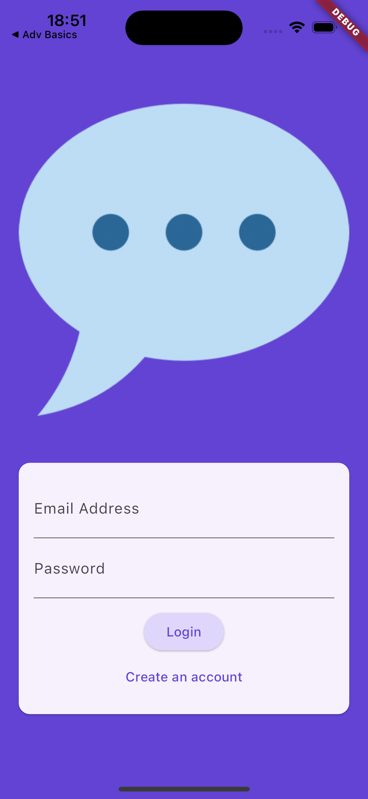
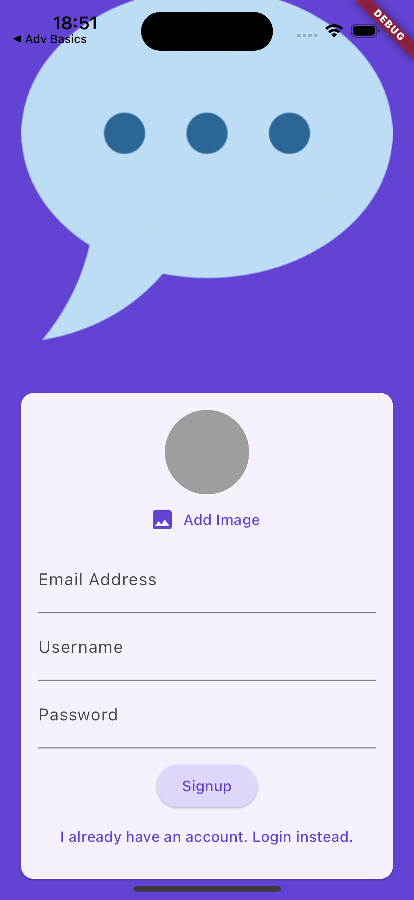
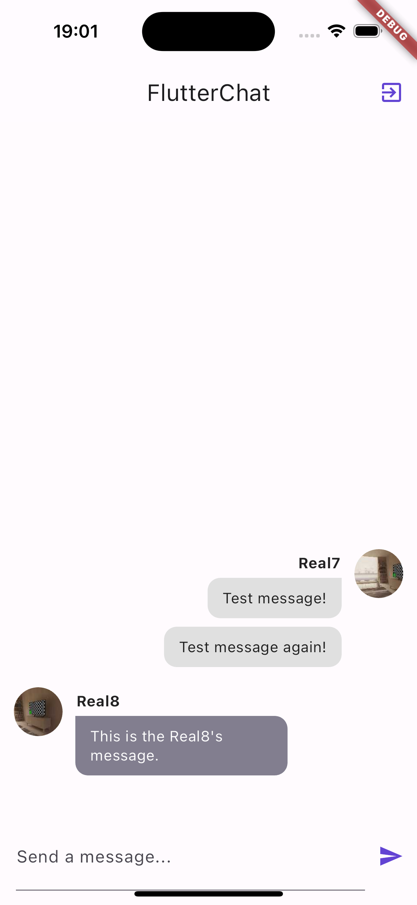
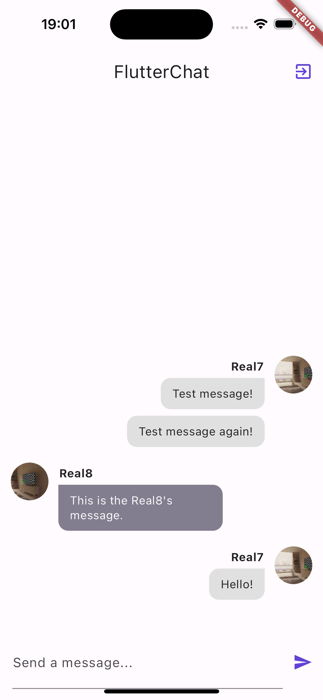

# chat_app
- チャットアプリ
- ログイン機能
  - プロフィール画像設定可能

## 使用技術

## 画面仕様
ログイン画面 アカウント作成済み | ログイン画面 アカウント未作成
--- | ---
 | 
メールアドレス、パスワードを入力 | ユーザー名、プロフィール画像を設定可能

チャット画面(1/3) | チャット画面(2/3)
--- | ---
 | 
チャット画面表示時 履歴があれば過去のチャットが表示される | メッセージ送信可能
